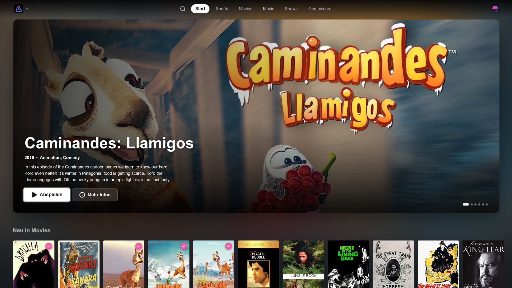

[![Contributors][contributors-shield]][contributors-url]
[![Forks][forks-shield]][forks-url]
[![Stargazers][stars-shield]][stars-url]
[![MIT License][license-shield]][license-url]
[![Release][release-shield]][release-url]

# Aurita - Yet another Jellyfin TV frontend

A highly opinionated TV-friendly frontend for Jellyfin, built for the living room.

## Motivation

I wasn't happy with the existing Jellyfin TV frontends. I needed one that had support for SyncPlay, some QOL features
like profile lock and a nice UI.

## Disclaimer

Since I needed a quick solution for my needs and I didn't want to spend a lot of time on this,
AI has been used in the development of this project.

I barely have enough time to maintain some of my other projects, so I'm not going to spend a lot of time on this.

This is also the reason why Issues and Pull Requests are disabled. You are more than welcome to fork this project and
make your own out of it, though.

This project is not affiliated with Jellyfin in any way.

## Why the name?

I went through a lot of names, and this is the only one I couldn't already find.

**Aurita** comes from *Aurelia aurita*, the moon jellyfish. I just found it quite fitting.

You know, because of Jellyfin? Yeah...

[contributors-shield]: https://img.shields.io/github/contributors/gnmyt/Aurita.svg?style=for-the-badge

[contributors-url]: https://github.com/gnmyt/Aurita/graphs/contributors

[forks-shield]: https://img.shields.io/github/forks/gnmyt/Aurita.svg?style=for-the-badge

[forks-url]: https://github.com/gnmyt/Aurita/network/members

[stars-shield]: https://img.shields.io/github/stars/gnmyt/Aurita.svg?style=for-the-badge

[stars-url]: https://github.com/gnmyt/Aurita/stargazers

[license-shield]: https://img.shields.io/github/license/gnmyt/Aurita.svg?style=for-the-badge

[license-url]: https://github.com/gnmyt/Aurita/blob/master/LICENSE

[release-shield]: https://img.shields.io/github/v/release/gnmyt/Aurita.svg?style=for-the-badge

[release-url]: https://github.com/gnmyt/Aurita/releases/latest
